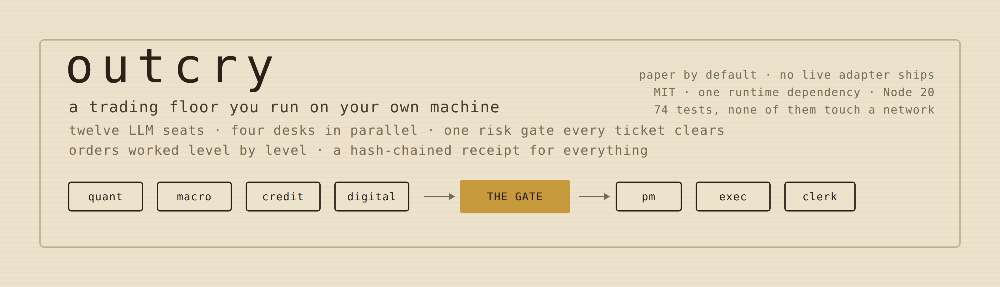
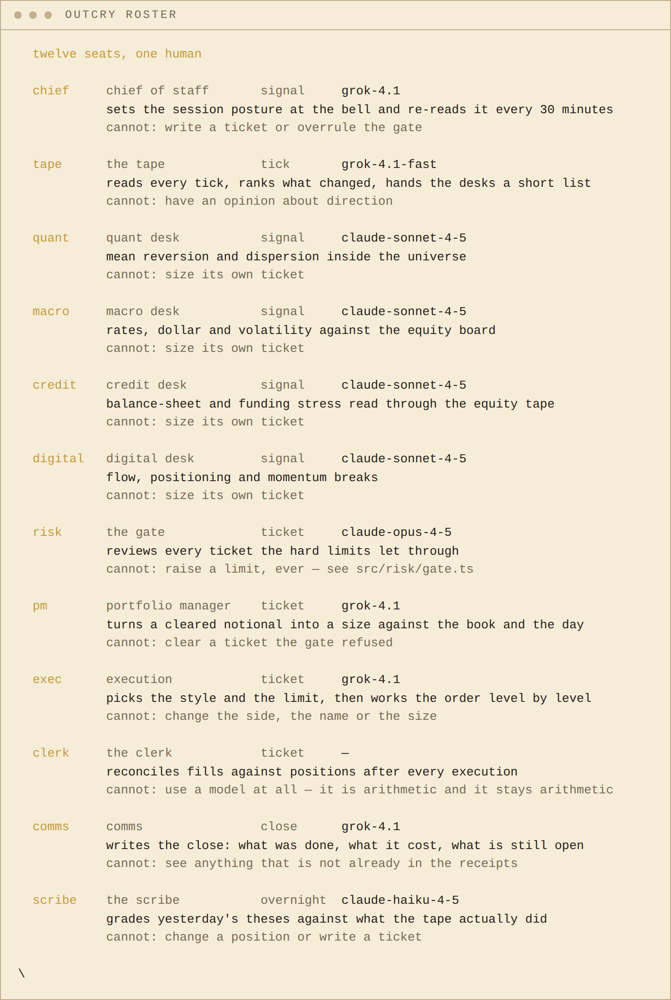
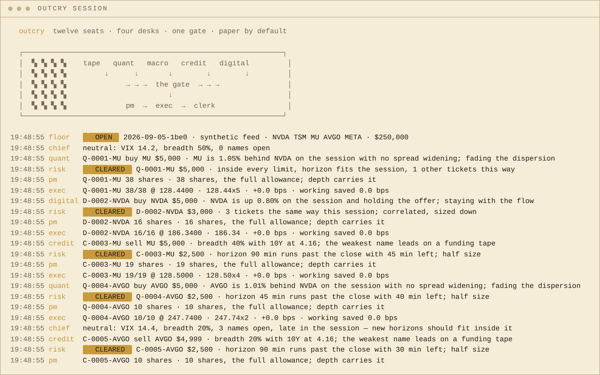
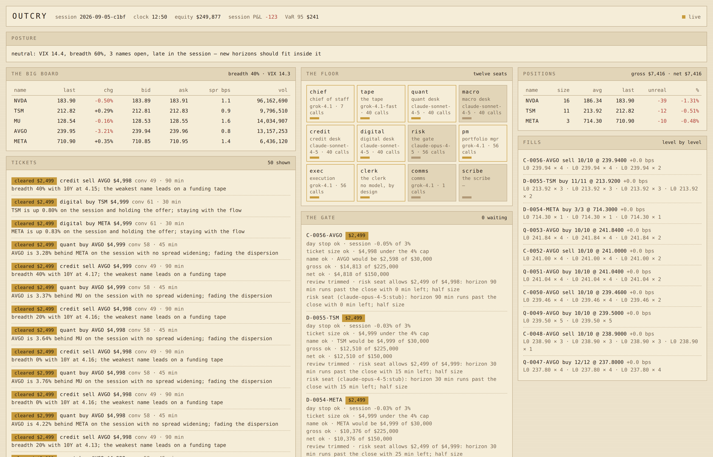
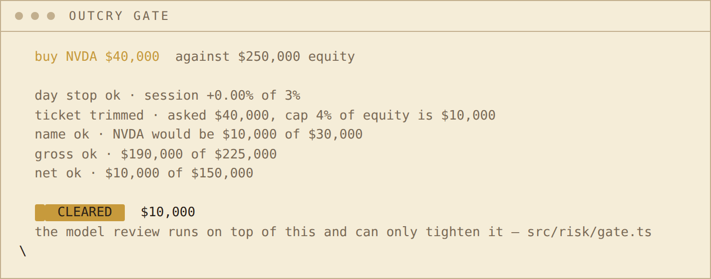
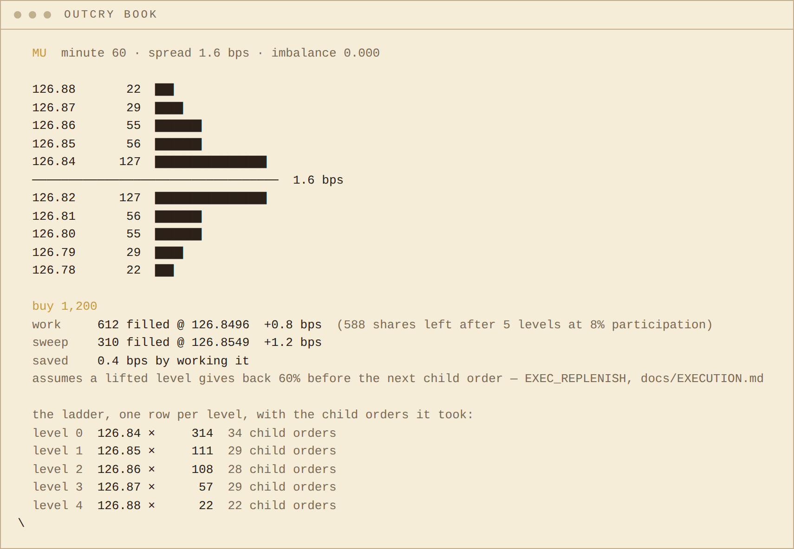
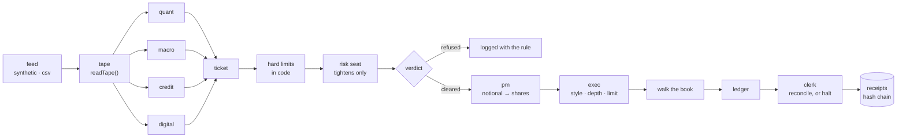

<p align="center">
  
</p>
<p align="center">
  
</p>

<p align="center">
  
  
  
  
  
  
  
</p>

<p align="center">
  <b>$GOWS</b> · Grok of Wall Street · <code>REPLACE_WITH_CONTRACT_ADDRESS</code>
</p>

Almost every "AI trading bot" is one prompt that answers buy or sell. This is an **organisation**: four desks
reading the same board in parallel and reaching different conclusions, a risk gate every ticket must clear
that can only ever make a number smaller, an execution seat that works an order through the book level by
level instead of hitting it once, and an overnight scribe that grades yesterday's theses against what the
tape actually did. Twelve seats, one loop, and a hash-chained receipt for every decision — which desk, on
what reading, cleared by which rule, filled at which levels. **Local, open, paper by default, no broker
adapter ships.**

| The problem | What outcry does | Command |
|---|---|---|
| one model deciding everything is one point of failure with a confident voice | four desks run in `Promise.all` on the same board and cannot see each other's drafts; whether they agree becomes information the gate is given | `open` · `floor` |
| "the bot bought — why?" | every ticket carries a falsifiable thesis with a number in it, and the schema refuses one under twenty characters | `receipts --kind ticket.written` |
| a model that can size its own trade has no limit at all | hard limits run in code first; the model review can lower the number or refuse, and **an attempt to raise it is recorded and discarded** | `gate` |
| "would that rule have stopped it?" | push a hypothetical ticket through every limit and read each rule in the order it fired | `gate --symbol NVDA --notional 40000` |
| a market order is one instruction that pays every level at once | child orders take their share of the touch and step down only when a level is used up; both styles priced against the same book, in basis points | `book <sym> --size N` |
| P&L says whether you were lucky, not whether you were right | the scribe grades the **reasoning** over its own horizon: 62 paid, 57 died, and which desk led | `open --score` |
| "did anyone edit this afterwards?" | every record hash-chained to the one before it; one changed field breaks the chain and names the line | `receipts --verify` |
| a paper simulator that quietly books gains it did not make | the clerk rebuilds the book from fill receipts alone and halts the floor if it disagrees with the ledger | runs on every fill |

---

## Install

Node 20 or newer. One runtime dependency. Nothing below needs an API key.

```sh
# 1. a checkout you can read and edit
git clone https://github.com/phosphenq/outcry && cd outcry
npm install
cp .env.example .env
npx outcry doctor
```

```sh
# 2. straight from GitHub, no clone
npm install -g github:phosphenq/outcry
outcry doctor
```

```sh
# 3. inside the checkout, without the bin
npm run doctor   ·   npm run open   ·   npm run floor
```

`.env` works out of the box. **With no key set, every seat runs its own offline rule, the floor completes a
full session, and every receipt says `provider: "stub"`** so nobody mistakes the run for a model's judgement.
That is also why `npm test` needs no network.

|  |  |
|---|---|
| **Required** | Node ≥ 20 |
| **Runtime dependencies** | `commander` |
| **For model seats** | `XAI_API_KEY` and/or `ANTHROPIC_API_KEY` in `.env`. Any OpenAI-compatible endpoint works |
| **Data** | a seeded synthetic feed out of the box; `TAPE_SOURCE=csv` for your own bars |
| **Live trading** | **not supported.** There is no live mode and no broker adapter in this repository — [docs/SAFETY.md](./docs/SAFETY.md) says why |

## Sixty seconds

```sh
outcry doctor            # what the floor believes: config, limits in dollars, which model sits where
outcry roster            # the twelve seats, and what each one structurally cannot do
outcry open --minutes 60 # a session, bell to bell, in your terminal
outcry floor             # the same engine behind a page on 127.0.0.1:1792
outcry receipts --verify # walk the hash chain of what just happened
```

---

## Commands

| Command | What it does | Needs a key |
|---|---|---|
| `doctor [--probe]` | resolved config, limits in currency, model per chair, a live feed check | no |
| `roster` | the twelve seats: job, cadence, model, and what each cannot do | no |
| `open` | run a session, bell to bell | no |
| `floor` | the engine behind a read-only local page | no |
| `tape [--for n]` | the board and the measured events, no desks and no orders | no |
| `book <sym>` | the ladder, and one order priced worked against swept | no |
| `gate` | a hypothetical ticket through every hard limit, rule by rule | no |
| `receipts [--verify]` | read a session's records, or check its hash chain | no |
| `positions` | what a session ended holding, rebuilt from fills alone | no |
| `replay <session>` | re-derive the close from the receipts and diff it | no |

Every flag and environment variable: [docs/COMMANDS.md](./docs/COMMANDS.md).

---

## roster

<p align="center"></p>

Seats are bound to models by **role**, not by name, so moving the whole floor onto one model is five lines in
`.env`:

```
MODEL_TAPE=grok-4.1-fast          # runs on every tick; the floor waits for it
MODEL_DESK=claude-sonnet-4-5      # four of these, in parallel
MODEL_GATE=claude-opus-4-5        # the strongest model, with the least authority
MODEL_FLOOR=grok-4.1              # chief, pm, exec, comms
MODEL_OVERNIGHT=claude-haiku-4-5  # the scribe, after the close
```

That is also the honest test of the whole idea: **if a floor of one model performs the same as a floor of
five, the arrangement is doing the work, not the model shopping.** Run it both ways with the same seed and
compare the receipts.

Two seats are deliberately unusual, and [docs/SEATS.md](./docs/SEATS.md) explains both:

- **The risk seat sits on the largest model and has the least power.** It can only ever make a number
  smaller. The failure that costs money is not a mediocre decision, it is an unbounded one.
- **The clerk has no model at all.** Its job is to catch the floor lying to itself, and a seat whose job is
  to detect a discrepancy cannot be the kind of thing that can be talked into an answer.

## open

<p align="center"></p>

One line per thing that happened, prefixed by the seat that did it. The loop, in one direction, with no
shortcuts:

```
tape → four desks in parallel → ticket → gate → pm → exec → ledger → clerk
```

Read the transcript above from a ticket down. `credit` wants to sell MU for a stated reason with a 90-minute
horizon. The gate clears it for half — *"horizon 90 min runs past the close with 45 min left"* — which is not
a risk limit, it is arithmetic nobody else ran. The PM turns the allowance into shares against the depth
actually showing. Execution works it and prints the ladder it climbed.

```sh
outcry open --minutes 60             # a short session
outcry open --seed 1792              # the same seed is the same 390 minutes, on any machine
outcry open --score                  # run the overnight scribe after the close
outcry open --loud                   # every seat, including the ones that decided nothing
```

## floor

<p align="center"></p>

The same engine behind a page on `127.0.0.1:1792`. Twelve seats with the model in each chair and its call
count, every verdict with every rule that fired in order, positions marked live, and fills shown level by
level.

**Every route is a GET.** There is no arm button, no order form, no parameter control, and no route that
mutates anything — a page that could arm a floor would be a page worth attacking. A pulse every ten seconds
tells a quiet session from a dead engine.

## gate

<p align="center"></p>

The order is the design, and it is fixed:

```
1. hard limits, in code, deterministic     →  an allowed notional
2. a model review of what got through      →  advisory only
3. the intersection                        →  the verdict
```

Step 2 can shrink the number or refuse. **It can never raise it.**

```ts
// src/risk/gate.ts
if (typeof asked === "number" && asked > v.allowed) {
  v.reasons.push(`review ignored · risk seat asked for $${asked}, above the hard allowance; a review can only tighten`);
  return v;
}
```

If the reviewer times out, throws, or returns something that does not parse, the hard result stands and the
reason line says so. A floor whose risk control depends on a model answering is not risk control. Every rule,
and what the risk seat is actually for: [docs/RISK.md](./docs/RISK.md).

## book

<p align="center"></p>

A sweep is one instruction: take every level at once, and the price you get is the last one you reached, not
the one you saw. Working the same order sends child orders that each take a share of what is displayed, and
steps to a worse price only when the level in front is used up.

**Working beats sweeping only because the book comes back between child orders — so that assumption is a
parameter, not a constant:**

```sh
outcry book NVDA --size 900 --minute 40                  # saved 0.7 bps at the default 60%
outcry book NVDA --size 900 --minute 40 --replenish 0    # saved 0.2 bps, and 296 shares short
```

Same book, same order, the whole advantage between those two numbers. Every `order.done` receipt carries
`savedBps` and the close summary averages it: if that number is not positive across a session, the execution
seat is costing the floor money and comms says so. [docs/EXECUTION.md](./docs/EXECUTION.md).

## receipts

```
$ outcry receipts --verify

  data/receipts/2026-09-05-ac58.jsonl
   INTACT  1253 records · head da19fce0eacd8c80…
  this is tamper-evident, not tamper-proof: a whole file can be rewritten and rehashed. It catches an edited line.
```

```
hash_n = sha256( seq | ts | kind | seat | body | hash_{n-1} )
```

That second line prints every time, because it is the honest limit. Anyone holding the file can rewrite it
end to end. What the chain catches is a **single edited line** — someone improving one fill after a bad
session — and it gives a session one short string you can publish before anyone asks to see the detail.

The head hash is **not** reproducible between runs and is not meant to be: receipts carry wall-clock
timestamps, so two identical sessions hash differently. What is reproducible is everything the seed controls
— the tape, the tickets, the verdicts and the fills — and the chain is what proves the file you are holding
is the one that was written.

`outcry replay <session>` goes further: it verifies the chain, then rebuilds cash and every position from the
`order.done` records alone and diffs the result against what the close claimed. Two independent paths to the
same number, days later, from a file. [docs/RECEIPTS.md](./docs/RECEIPTS.md).

---

## How it works



Five things are enforced in `src/floor/floor.ts` rather than requested in a prompt, and each has a test whose
name is the sentence:

- **only the four desks may originate a ticket** — the other eight seats have no path to one
- **every ticket goes through the gate** — `test/gate.test.ts` reads the source and asserts there is exactly
  one call to `gate.decide` and exactly one to `ledger.apply` in the whole file
- **the PM's size is clamped to the gate's allowance** — a larger number is recorded and replaced
- **execution may not change the side, the name or the size** — checked across every order in a real session
- **the clerk reconciles after every fill, and a break halts the floor** — not a warning, a halt

`src/risk/gate.ts` takes a `Reviewer` function rather than an `Agent`, so the risk module has never heard of
a prompt. Risk control that imports the agent layer is risk control you have to read the agent layer to
trust. [docs/ARCHITECTURE.md](./docs/ARCHITECTURE.md).

## Numbers behind the defaults

One session, offline, so anyone can reproduce it exactly:

```sh
outcry open --minutes 390 --seed 1792 --score
```

| | Measured 2026-09-05, seed 1792, every seat offline |
|---|---|
| session | 390 market minutes, $250 000 paper equity |
| tickets | 141 written, 141 cleared, 0 refused |
| the gate | **139 of 141 trimmed**, 2 cleared at full size — trimming is preferred to refusing, and a desk whose tickets are always trimmed is asking for too much |
| fills | 141 parent orders, 467 child orders |
| execution | 0.0 bps average slippage and 0.0 bps saved: at this size against these names, both styles fill inside the touch. The saving appears on size — `outcry book MU --size 1200` prices an order that does not |
| receipts | 1 253 records, chain intact |
| overnight | 62 theses paid, 57 died, 22 still open at the bell |
| working vs sweeping | NVDA 900 shares at minute 40: **0.7 bps** saved at `EXEC_REPLENISH=60`, **0.2 bps** at `0` |
| offline cost | zero. No key, no network, 74 tests |

**There is no performance figure in this table and there will not be one.** A return produced by the
simulator described in [docs/SAFETY.md](./docs/SAFETY.md) would not mean anything, and printing one would be
the only dishonest thing in this repository.

## Tests

```sh
npm test
```

Seventy-four checks, none of which touch a network. The book walk against a hand-written ladder where every
expected number can be checked by hand; the sweep-versus-work difference at three replenishment rates; the
limit that stops an order; every hard limit including the three that are easy to get wrong (a reducing
ticket is not measured against the name cap, only a *new* name is refused by the name count, the day stop is
checked first); the invariant that a review cannot raise an allowance, in four forms; a reviewer that throws,
returns null, or answers gibberish; realising P&L on a reduce and on a fill that crosses zero; the clerk
catching an orphan position and a doubled fill; four ways to break the hash chain; a whole session bell to
bell with the same seed twice; and the source-reading test that fails if anyone adds a second path from a
ticket to a fill.

## FAQ

**Is it safe to run?** Nothing in this repository can place an order anywhere. There is no live mode, no
broker adapter and no `--live` flag. With no key set, nothing leaves your machine at all. With keys set, what
leaves is the brief each seat is given — market data and your own configuration.

**Does it make money?** Unknown, and this repository does not try to answer it. The simulator has no market
impact, no adverse selection, no queue position and no other participants, all of which make real trading
worse than what you see here. The numbers printed are an **upper bound**, not an estimate.

**Why not just use one strong model?** Maybe you should — and the config exists so you can test it. What
twelve seats buy is not accuracy, it is legibility: when a session goes wrong the question is never "which
agent did this", it is "which receipt", and the receipt names the seat, the model and the reasoning.

**Why did the gate trim almost everything?** Because trimming is the default behaviour and refusing is rare
by design. A trim keeps the desk's information in the book at a size the floor survives; a refusal throws it
away. The `reasons` array on every verdict names the rule that did it.

**Can I use my own data?** `TAPE_SOURCE=csv` and one `<SYMBOL>.csv` per name. A bar is not a book, so depth
is inferred from the bar's own range and volume, and every receipt from a replay says `book: "inferred"` —
a fill against inferred depth is never presented as a fill against real depth.

**Can I add a desk?** A prompt file, a case in the offline fallback, an entry in the roster. The gate needs
no changes, and that is the test.

**Is it front-running / market manipulation / anything a venue would object to?** It never touches a venue.

## Built on

| Source | What was taken |
|---|---|
| Node 20 standard library | the hash chain, the SSE server, the HTTP client, the test runner |
| [`commander`](https://github.com/tj/commander.js) | argument parsing, and the whole of the dependency list |
| the open-outcry pit | the name, and the idea that an intention announced out loud is worth more than a price that appears from nowhere |
| every risk manual that puts limits in code and opinions after them | the order of `src/risk/gate.ts` |

outcry is independent of xAI, Anthropic, Robinhood and every venue and vendor named anywhere in it. Model
names appear only as configuration defaults; no marks are used and none are implied. The mark, the palette
and every image in this README are its own — [docs/BRAND.md](./docs/BRAND.md).

## License

MIT. It is a rehearsal room, not a market. Keep it that way.
