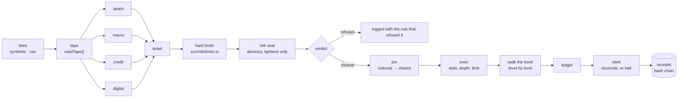

# Architecture



## The loop

`src/floor/floor.ts` runs one loop in one direction. Per market minute:

1. the feed ticks and publishes the whole board
2. every `postureEvery` minutes (30) the chief re-reads the posture
3. every `signalEvery` minutes (5) a **signal**:
   - `readTape` measures what changed — arithmetic, before any model is asked anything
   - the tape seat ranks and narrates those events
   - **the four desks run in `Promise.all`** on the same board, and cannot see each other's drafts
   - each draft becomes a ticket and goes through the gate, in a fixed desk order so a session replays

At the close, comms writes the summary from the receipt figures, and `outcry open --score` runs the scribe.

## Why the desks cannot see each other

Four agents that can read each other's work converge. Feed one of them a claim and it becomes four agents'
claim, and the correlation the risk seat is there to catch stops being visible in the tickets at all.

So they run in parallel from the same state and their only shared context is one sentence of posture. Whether
they agree is then information: three desks the same way is a signal the risk seat is given explicitly, and
its offline rule trims the third such ticket to 60% on those grounds alone.

## Module boundaries

Everything crossing a boundary is a shape in `src/types.ts`, flat and JSON-safe, because it ends up inside a
receipt and a receipt that cannot be re-read is not a receipt.

| Module | Knows about |
|---|---|
| `tape/` | nothing but its own data source; every consumer is written against the `Feed` interface |
| `book/` | a `BookState` and arithmetic. No agents, no config, no I/O |
| `risk/` | positions, marks, limits, and a `Reviewer` function. **It has never heard of an agent or a prompt** |
| `ledger/` | executions and receipts. Two independent paths to every number |
| `agents/` | prompts, providers, schemas. **No seat can write to the ledger or call another seat** |
| `floor/` | the only module that connects the others, and the only place any rule is enforced |
| `floorview/` | reads `floor.state()`. Every route is a GET |

`src/risk/gate.ts` taking a `Reviewer` function rather than an `Agent` is the load-bearing one: risk control
that imports the agent layer is risk control you have to read the agent layer to trust.

## The feed

```ts
interface Feed {
  tick(): TapeSnapshot | null;   // advance and publish the whole board
  peek(): TapeSnapshot;          // the current board
  book(symbol: string): BookState;
  readonly minute: number;
  readonly done: boolean;
}
```

Two implementations ship:

- **`synthetic`** — seeded, offline, reproducible. A drift-free walk per name at its own volatility, one
  market factor every name loads on, a U-shaped intraday volume curve, a spread that widens with volatility,
  and a five-level book whose depth thins geometrically. It models no news, no earnings, no halts, no
  auctions, no borrow and nobody else's order flow. It is a rehearsal room, not a market.
- **`csv`** — your own bars, one `<SYMBOL>.csv` per name. A bar is not a book, so depth is inferred from the
  bar's own range and volume, and every receipt written during a replay says `book: "inferred"` so a fill
  from a replay is never mistaken for a fill against real depth.

A third implementation that speaks to a live vendor is about thirty lines. It is deliberately not included;
[SAFETY.md](./SAFETY.md) says why.

## Determinism

`TAPE_SEED` produces the same 390 minutes on any machine. With every seat offline, the same seed produces the
same tickets, the same verdicts and the same close — asserted in `test/floor.test.ts`.

With models in the seats it does not, and cannot. That is the reason the seed is written into the
`session.open` receipt: the tape half of any claim is reproducible by anyone, and the model half is at least
pinned to a named model with its round-trip time recorded.

## Adding something

- **A desk** → `prompts/<name>.md`, a case in `fallbackFor`, an entry in `ROSTER`, add it to `DESKS`. The gate
  needs no changes; that is the test.
- **A data source** → implement `Feed`. Nothing downstream changes.
- **A limit** → one block in `checkHard` that pushes its reason and either trims `allowed` or refuses. Order
  matters: the reasons array is read top to bottom by a human.
- **A model provider** → implement `Provider`. `providerFor()` routes by model name.

## Dependencies

One at runtime: `commander`, for argument parsing. Everything else — the hash chain, the SSE server, the
HTTP calls to model endpoints, the book model, the statistics — is Node's standard library and about 2 800
lines of TypeScript you can read in an evening.

That is not asceticism. A repository that asks you to run a trading floor on your machine and arrives with
four hundred transitive dependencies is asking for trust it has not earned.
